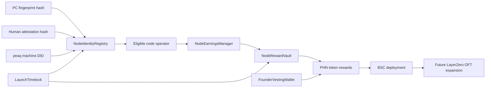

# Architecture

## Feature expansion ideas
- node uptime proofs
- proof-of-useful-work receipts
- machine reputation tiers
- operator staking and slashing
- DAO governance for reward curves
- NFT node passports
- service marketplace fees paid in PHN
- emissions schedule from reward vault instead of discretionary rewards
- heartbeat-based rewards for verified nodes
